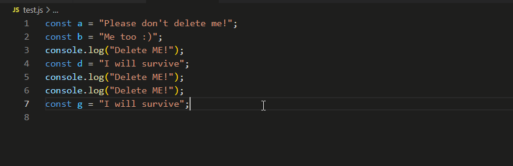

# Printier

Removes all of annoying print statements you used while debugging your program. Currently supports JavaScript, Python, Java, C/C++

# How to use

1. Open VSCode and type ctrl+Shift+P.
2. Type Remove print statment.

Thats it !

## Features

1. No need of configuration. Everything works out of the box.
2. No need to specify which programming language you are currently using.

## Installation
Open VSCode and type ctrl+P, type ext install zain2323.printier.